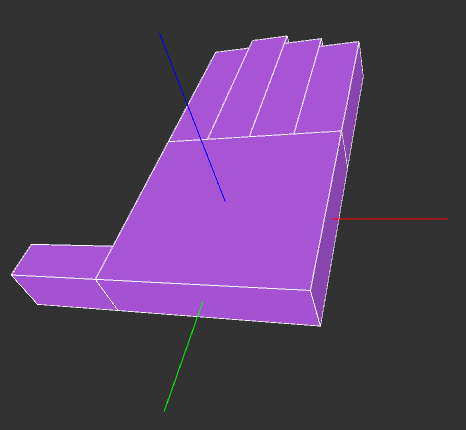

# Luva de dados 🧤

Neste repositório, você vai encontrar os códigos fontes relacionados ao desenvolvimento da Luva de Dados do L-VIS (Laboratório de Visualização, Interação e Simulação).

É preciso ter o [Arduino IDE](https://www.arduino.cc/en/software/) e o [Processing](https://processing.org/download) instalados no seu computador.

## Montagem ⚡

Você precisará de: um Arduino (neste exemplo usaremos o UNO), um sensor MPU-6050 e uma luva para apoiar o sensor.

São necessárias apenas as conexões dos 4 pinos de cima do MPU-6050, ou seja: **VCC**, **GND**, **SCL** e **SDA**. Os demais pinos não precisam de conexão.

Com exceção do pino de **VCC**, quase todos os pinos do MPU-6050 são conectados aos pinos de mesmo nome no Arduino. O **VCC** pode ser conectado na saída de 3.3 V ou de 5 V.

O sensor deve ser posicionado de forma que o eixo **x** (em vermelho) aponte para a direção oposta ao polegar, o eixo **y** (verde) aponte para a direção do pulso e o eixo **z** (azul) normal à superfície das costas da mão.
