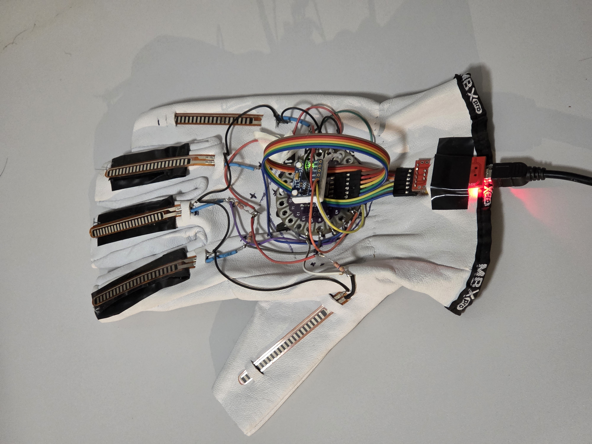
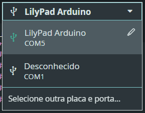

# 🧤 Luva de dados

Neste repositório, você vai encontrar os códigos fontes relacionados ao desenvolvimento da Luva de Dados do L-VIS (Laboratório de Visualização, Interação e Simulação).

Para rodar os programas deste repositório ao conectar a luva no seu computador, é preciso ter o [Arduino IDE](https://www.arduino.cc/en/software/) e o [Processing](https://processing.org/download) instalados. Como também a biblioteca [MPU6050_tockn](https://github.com/Tockn/MPU6050_tockn) instalada na sua Arduino IDE.

## ⚡ Como Usar os Programas

### 🌡️ BaudRate (caso queira alterar)

Como o Arduino Lilypad está sendo conectado ao computador pelo módulo FTDI, certifique-se de que o valor do BaudRate do programa de visualização seja o **dobro** do valor do código-fonte do Arduino, pois caso contrário, a comunicação serial estará dessincronizada.

Na linha 3 do código fonte da visualização, o BaudRate pode ser alterado. Ela vai ter algo como isso escrito:

`final int BAUDRATE = 19200;`

Já no código em python, o BaudRate pode ser alterado diretamente na rotina `setup` que vai ter uma linha como essa:

`Serial.begin(9600);`

### 🚪 Porta Serial

Na hora de carregar o código no Arduino, a porta serial pode não ser a mesma que está no programa de visualização, então preste atenção no **nome** e no **número** da porta `COM` que o Arduino estiver conectado:

Pois no código-fonte do programa em Processing, a porta deve ser a mesma. Isso pode ser verificado na linha 4:

`final String PORTA = "COM5";`

### 🔌 Conexão e Visualização

Para conectar a luva de dados ao computador, basta usar um cabo de Micro-USB para USB, e mantê-lo sempre conectado enquanto utilizar o programa de visualização 3D, que deve mostrar algo assim:

O programa não abrirá sem a luva estar conectada e com a porta serial devidamente selecionada.